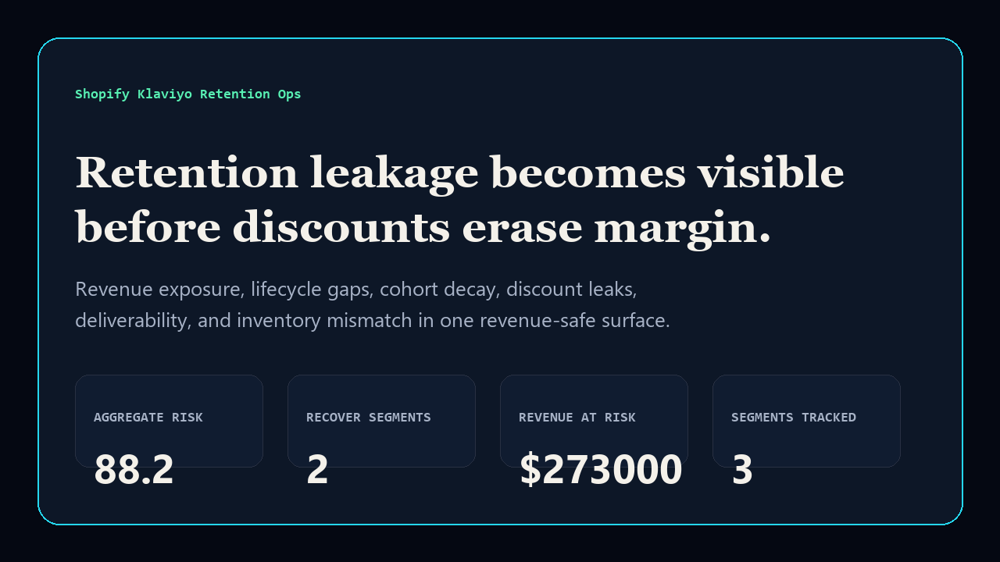
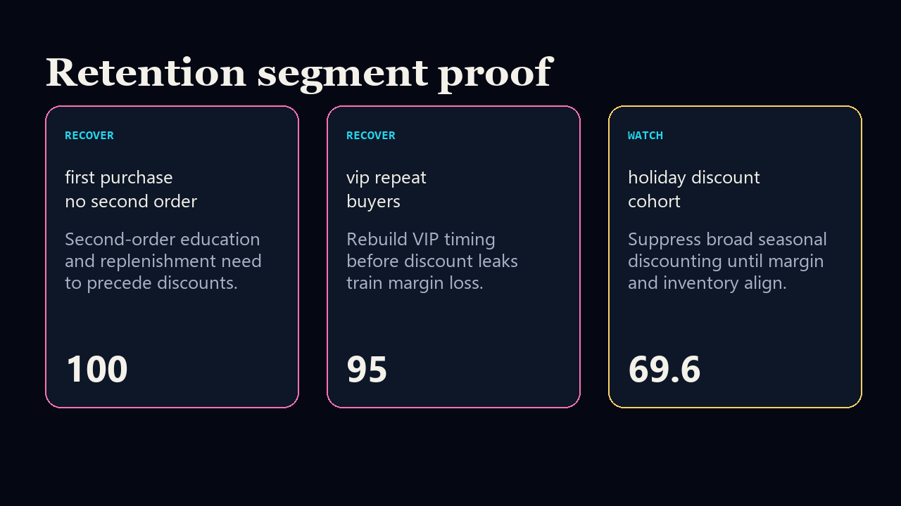

# shopify-klaviyo-retention-ops

[](https://github.com/mizcausevic-dev/shopify-klaviyo-retention-ops/actions/workflows/ci.yml)
[](https://github.com/mizcausevic-dev/shopify-klaviyo-retention-ops/actions/workflows/pages.yml)
[](LICENSE)

Shopify Klaviyo Retention Ops is a revenue-operations surface for retention leakage, lifecycle gaps, repeat-purchase decay, discount leakage, deliverability risk, and inventory mismatch.

## Why this exists

- Shopify and Klaviyo teams often see revenue, lifecycle, inventory, and offer data in separate tools.
- Retention work gets expensive when discount pressure hides cohort decay and margin leakage.
- This repo gives e-commerce leaders a compact Ruby, TypeScript, and SQL proof surface for deciding what to recover, watch, and suppress.

## Screenshots





## What it includes

- TypeScript scoring model and static executive surface.
- Ruby scorer with Minitest coverage.
- SQL views for segment risk and board retention posture.
- Synthetic Shopify/Klaviyo retention fixture.
- CI, Pages publishing, smoke checks, docs, and security notes.

## Local run

```bash
npm install
npm run verify
npm run prerender
```

## Board question answered

> Where are we leaking retention margin, which segments should recover first, and which offers should be suppressed before they train bad behavior?
